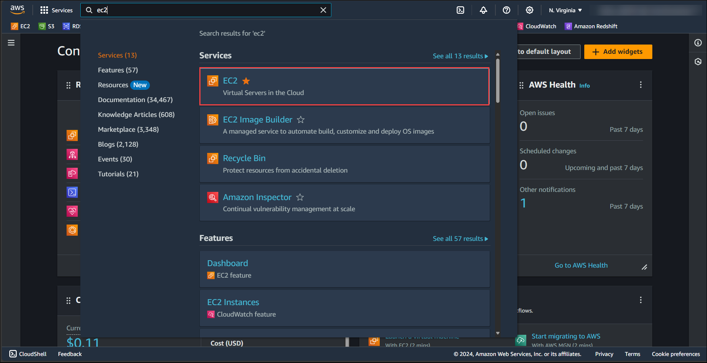
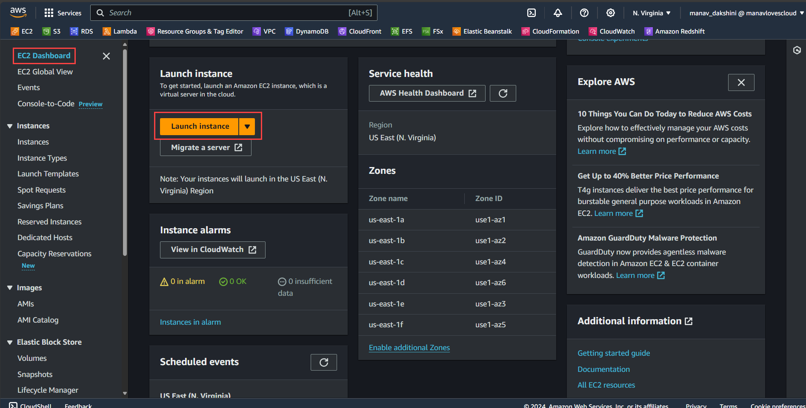
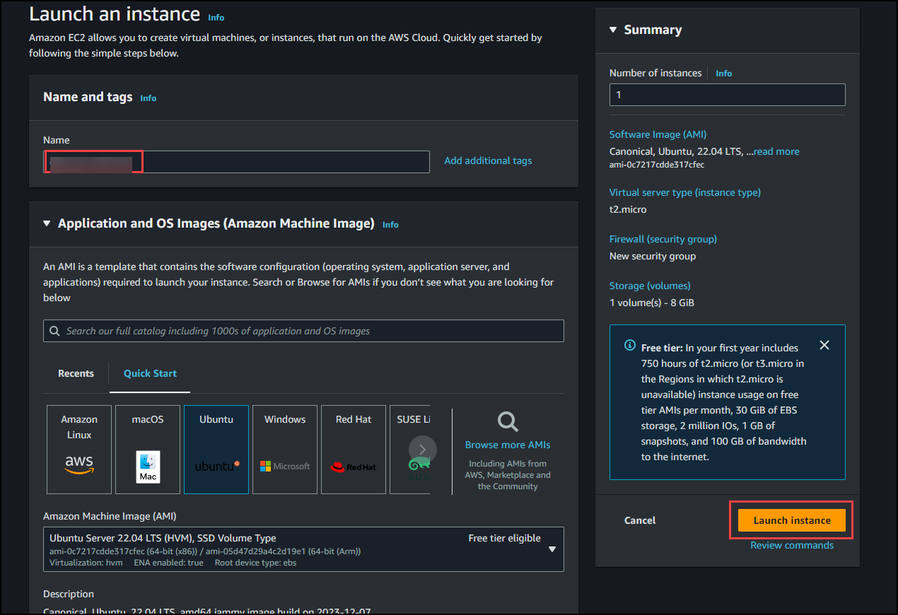
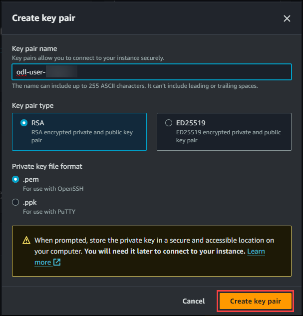

# Exercise 1: Create an EC2 Instance

Follow below steps to create an EC2 Instance.

1. Select the region as **US-EAST-1(N.Virginia)** from Drop Down menu.

    

2. At the top of the AWS Management Console, in the search bar, search for the service **EC2**.

    

3. At the EC2 Dashboard click on **Launch Instance.**

    

4. Create the Instance with the name odl-user-<CloudLabsDeploymentID>

    

5. Create a key pair with name odl-user-<CloudLabsDeploymentID>

    

<validation step="6c32922e-75c9-4519-9452-910680384fc1" />

<validation step="e6c0346a-a1fc-4fd5-a99c-8645a35897a5" />

