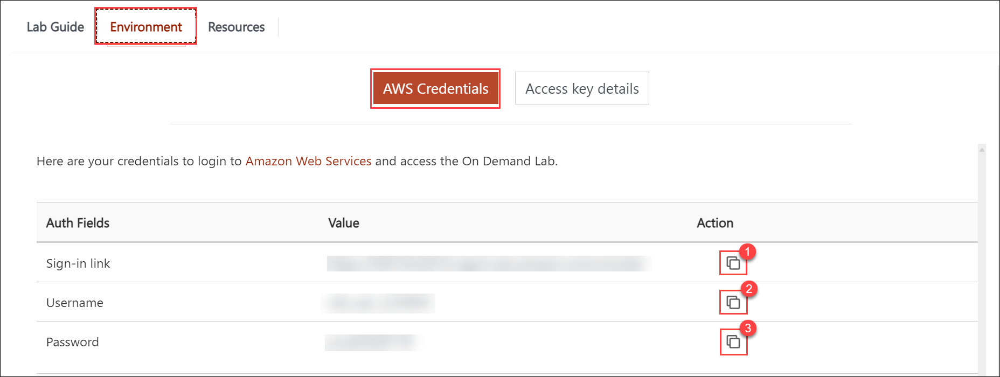

# Inline Validation test

1. Sign in to the AWS Management Console by copying the **Sign-in link, Username, and Password** provided below.

    * **Sign-in Link**: **<inject key="SignInUrl" enableCopy="true" />**

    * **IAM Username**: **<inject key="UserName" enableCopy="true" />**

    * **Password**: **<inject key="Password" enableCopy="true" />**

    

    Alternatively, you can also find these values on the **CloudLabs** Environment tab.

    

