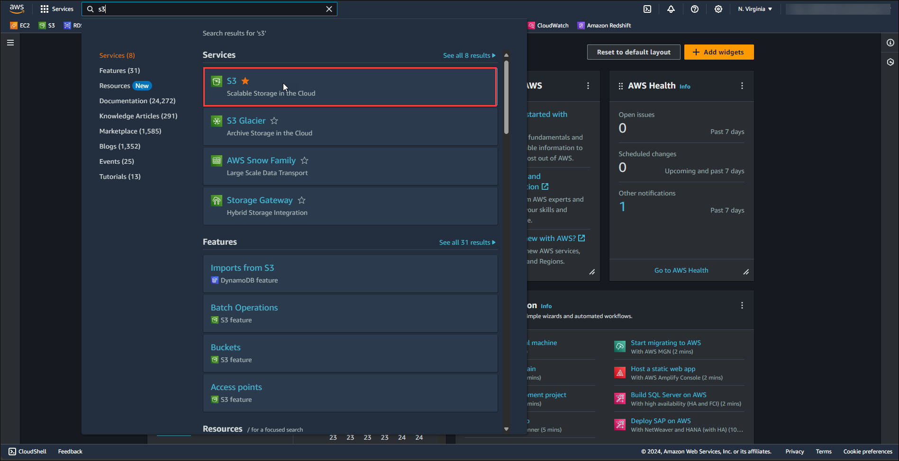
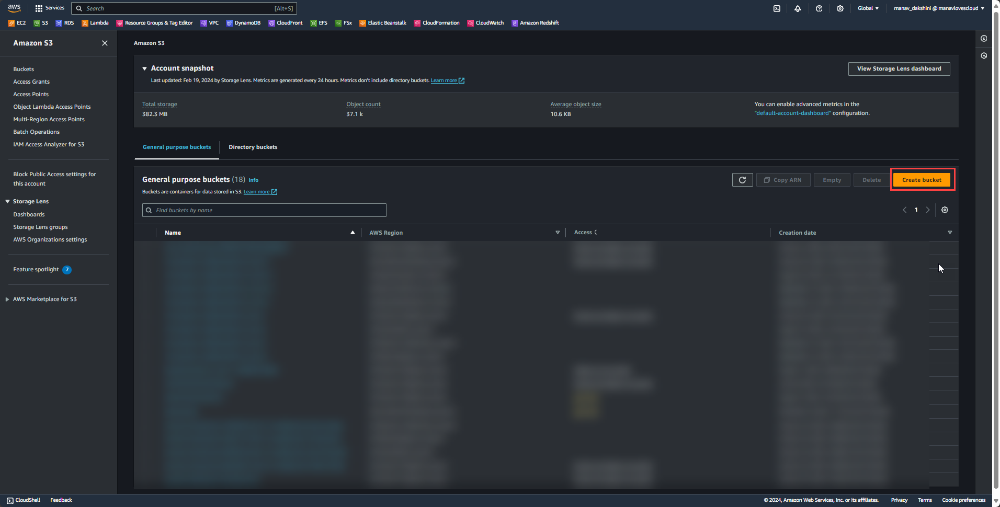
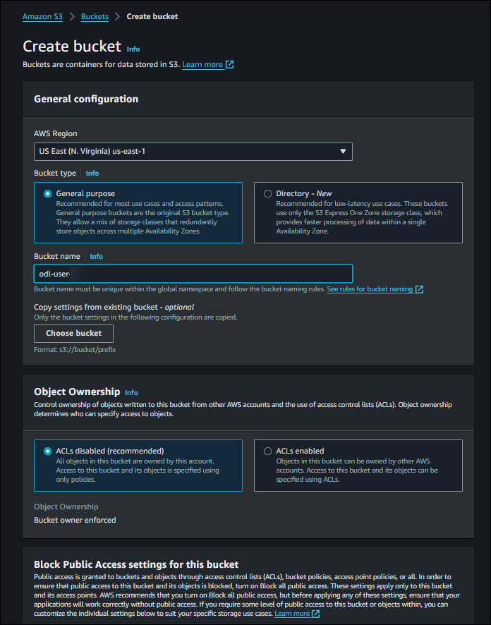

# Exercise 2: Create a S3 Bucket

Follow below steps to create an S3 Bucket.

1. At the top of the AWS Management Console, in the search bar, search for the service **S3**.

    

2. At the S3 dashboard click on **Create Bucket**

    

3. Give bucket name as odl-user-**<inject key="CloudLabsDeploymentID" enableCopy="true" />**

    

4. Click on **Create Bucket**

# Validation

<validation step="582bc76b-fe5a-493b-aab4-143877ac4504"/>
